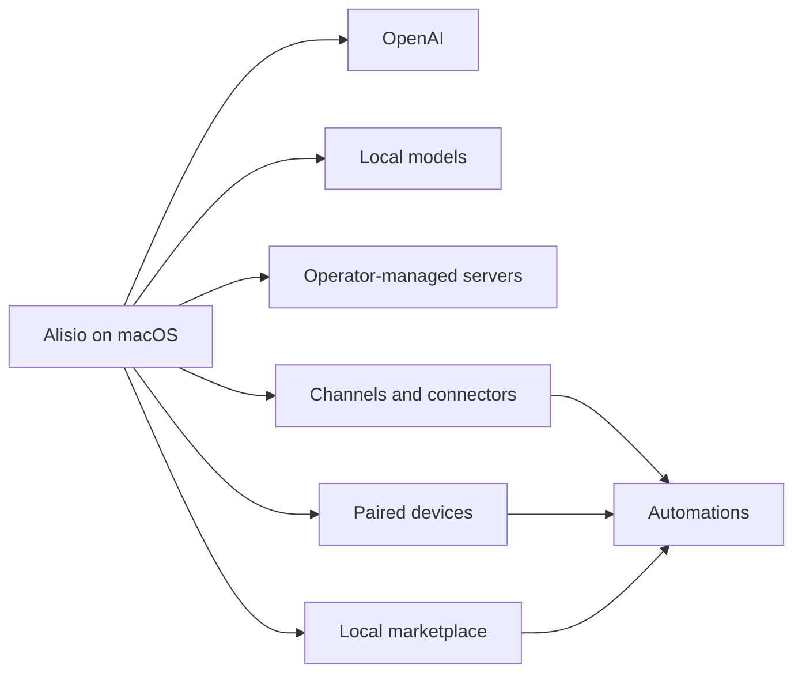

## Alisio Vision

Alisio is the AI workspace that lives on your computer.

The product is desktop-first, macOS-first, and personal by default. The app is the main surface. The CLI exists for operations, automation, and remote administration, but it is no longer the story we lead with.

Project overview: [`README.md`](README.md)
Contribution guide: [`CONTRIBUTING.md`](CONTRIBUTING.md)

## Product Direction

Alisio should feel like one coherent system:

- a desktop app that owns the first-run experience
- an AI layer that can use OpenAI, local runtimes, or operator-managed servers
- a local marketplace on each computer for skills, apps, and integrations
- channels and connectors that bring in work and send work back out
- devices that extend the system with local capabilities and permissions

## Current Priorities

- Make the macOS setup path reliable enough that most users never need the terminal
- Keep OpenAI setup simple while making local and server-backed AI first-class
- Make device permissions and device-local actions explicit, visible, and useful
- Turn channels and connectors into practical automation surfaces
- Keep the product understandable for non-developers without removing depth for operators

## Trust Model

Alisio is still a personal-assistant trust model.

That means:

- one trusted operator boundary by default
- strong defaults around permissions, device access, and message ingress
- clear escalation when a setup becomes multi-user, remote, or exposed to untrusted input

Security is still a core concern, but it should not force users into a terminal-first setup just to understand what is happening.

## AI Strategy

Alisio should make three AI paths feel equally intentional:

1. **OpenAI** for fast, high-quality hosted setup
2. **Local** for privacy, ownership, and offline or low-latency loops on capable machines
3. **Servers** for OpenAI-compatible deployments on another machine or inside a private network

The user should be able to mix these paths, switch between them, and set fallbacks without learning internal config structure first.

## Marketplace And Extensibility

The marketplace is local-first.

Each computer should be able to carry its own set of:

- skills
- apps
- connectors
- runtime-specific add-ons

Core stays opinionated and small. Optional capability should usually live outside the base product and be installable where it runs.

## Devices, Channels, And Automations

Devices are not a side feature. They are part of the product model.

- macOS is the primary device shell
- iPhone extends capture, voice, camera, and mobile presence
- channels are both inboxes and delivery targets
- connectors and channels should compose into real automations

The product should make it obvious which actions run:

- on this Mac
- on another paired device
- in a local runtime
- on a remote server

## What We Will Not Optimize For

- A terminal-only first impression
- A cloud-only control plane
- A single global marketplace that ignores per-computer reality
- Hiding permissions, trust boundaries, or automation consequences behind vague UX
- Forcing users to choose between hosted AI and local AI when both can coexist

## Implementation Stance

TypeScript remains the practical implementation language for the control plane, tooling, protocol surfaces, and extensibility model.

That is an implementation choice, not the product identity.

The product identity is:

- desktop-first
- personal by default
- local-aware
- automation-capable
- composable through channels, connectors, devices, and skills
