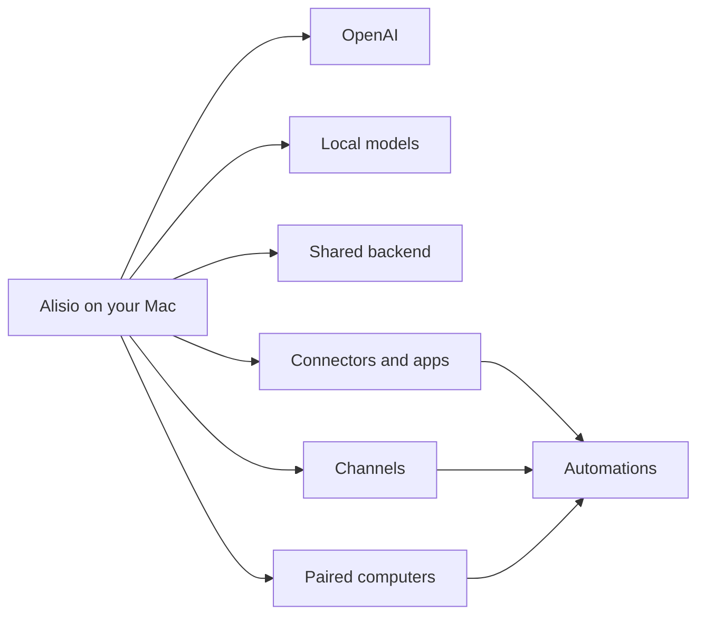

# Alisio

  

  <strong>Desktop-first AI for your own computer.</strong> 
  Start on macOS, sign in, choose OpenAI, Local, or Server, then add channels, devices, and automations around a shared backend.

<Columns>
  <Card title="Product Overview" href="/start/overview" icon="layout-panel-top">
    What Alisio is, who it is for, and what the first sellable product looks like.
  </Card>
  <Card title="Getting Started" href="/start/getting-started" icon="rocket">
    Install the macOS app, sign in with your Alisio account, grant permissions, and choose your AI source.
  </Card>
  <Card title="macOS App" href="/platforms/macos" icon="monitor-smartphone">
    The primary product surface for setup, permissions, devices, and daily use.
  </Card>
</Columns>

## What Is Alisio?

Alisio is a personal AI workspace that runs on your own computer and expands outward from there.

The native macOS app is the center. Sign-in is required because the workspace is account-backed. Around it, you can add:

- your Alisio account plus OpenAI credentials when needed
- local models on the machine you are using
- a shared backend on this machine or another machine
- channels such as WhatsApp, Telegram, Slack, Discord, and email
- connectors, apps, and skills from a local marketplace on each computer
- paired computers for camera, voice, screen, notifications, and automation

## Product Shape

## Start Here

<Columns>
  <Card title="Overview" href="/start/overview" icon="book-open">
    Product positioning, use cases, and the minimum sellable product.
  </Card>
  <Card title="AI Sources" href="/concepts/model-providers" icon="cpu">
    OpenAI, local runtimes, and OpenAI-compatible servers.
  </Card>
  <Card title="Computers" href="/nodes" icon="smartphone">
    Device-local actions, permissions, and pairing.
  </Card>
  <Card title="Skills" href="/tools/skills" icon="sparkles">
    Skills, apps, and the local marketplace on each computer.
  </Card>
  <Card title="Memory" href="/concepts/memory" icon="brain">
    Durable context stored in your workspace.
  </Card>
  <Card title="Help" href="/help/troubleshooting" icon="life-buoy">
    Troubleshooting, environment details, and backend/operator setup paths.
  </Card>
</Columns>
