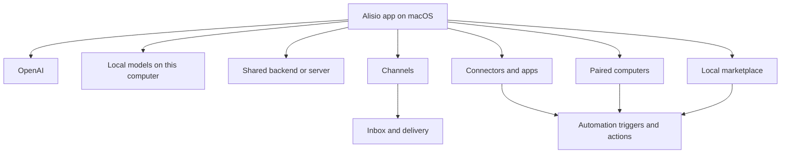

# Product Overview

Alisio is a desktop-first AI workspace.

The primary product is the macOS app. It gives one computer a coherent AI layer that can use OpenAI, local models, or a shared backend, then connect that AI to channels, other computers, connectors, and automations.

## The Short Version

Alisio turns one computer into:

- your AI front door
- your signed-in account home for that workspace
- your local automation runtime
- your control point for channels, connectors, and paired computers
- your place to install skills, apps, and integrations

## Product Pillars

- **Desktop-first**: the app is the main experience, not an afterthought for a gateway.
- **Account-backed**: sign-in is required because the workspace is tied to a real product identity.
- **macOS-first**: first-run quality, permissions, voice, notifications, and device control start on the Mac.
- **OpenAI plus local**: hosted and local AI should coexist cleanly.
- **Shared backend**: backend runtime can move without becoming the product UI.
- **Windows native frontend**: Windows now has a native app for setup, settings, and shared-backend chat, while macOS remains the most complete local-desktop surface.
- **Per-computer marketplace**: every computer has its own installable skills, apps, and integrations.
- **Automation through real surfaces**: channels, connectors, schedules, and computers are practical automation inputs and outputs.

## How It Fits Together

## Typical Use Cases

### Real estate

- qualify inbound leads from WhatsApp, email, and shared inbox sources
- summarize documents and property notes
- schedule follow-ups and reminders
- trigger automations from channels and connectors

### Clinic

- organize inbound messages and patient follow-up
- summarize calls, voice notes, and uploaded documents
- route tasks to staff through channels
- keep computer-local capture and notifications on the clinic Mac

### Accounting

- collect PDFs, invoices, and statements from email and chat
- classify routine requests before human review
- draft follow-up questions automatically
- run recurring workflows that combine channels, connectors, and local files

## Minimum Sellable Product (MSP)

The first minimum sellable version of Alisio should include:

1. A polished macOS install and first-run flow with sign-in and permissions.
2. AI source selection with three obvious choices: OpenAI, Local, and Server.
3. A shared backend story that supports the app without replacing it as the primary product surface.
4. A local marketplace per computer for skills, apps, and integrations.
5. Computer-aware actions on the current Mac plus pairing for other computers.
6. Channels and connectors as automation inputs and outputs.
7. Durable workspace memory and simple operator-visible settings.

If those seven things feel coherent, Alisio is sellable.

## What The MSP Is Not

- not a terminal-first product
- not a web product
- not a cloud-only assistant
- not a generic wrapper around one model provider
- not a shared global marketplace that ignores where things actually run

## Where To Go Next

- Start here: [Getting Started](/start/getting-started)
- macOS product surface: [macOS App](/platforms/macos)
- AI sources: [Model Providers](/concepts/model-providers)
- Local and server runtimes: [Local Models and Servers](/gateway/local-models)
- Computer actions: [Computers](/nodes)
- Skills and marketplace: [Skills](/tools/skills)
